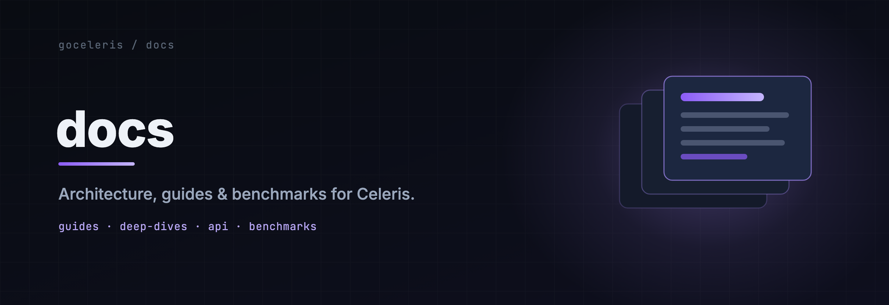

<p align="center">
  
</p>

<h1 align="center">Celeris docs</h1>

<p align="center">
  The official documentation, architecture deep-dives, and benchmark dashboard for
  <a href="https://github.com/goceleris/celeris">Celeris</a> — served at
  <a href="https://goceleris.dev"><strong>goceleris.dev</strong></a>.
</p>

<p align="center">
  <a href="https://goceleris.dev"></a>
  <a href="LICENSE"></a>
  
  =1.3">
</p>

---

This repository builds **goceleris.dev**: the landing page, the user documentation,
and the live benchmark dashboard. It is a fully static [Astro](https://astro.build)
site — every page, including the dashboard, is rendered at build time and served as
plain HTML with one small client island.

Benchmark data is the interesting part. Committed benchmark cells live in
[`results/`](results/), the site reads that tree directly at build time, and it
derives every dashboard asset itself — there is no database and no server.

Part of the Celeris family:

| Repo | What it is |
| --- | --- |
| [celeris](https://github.com/goceleris/celeris) | The HTTP framework and its four I/O engines |
| [loadgen](https://github.com/goceleris/loadgen) | The load generator behind the benchmarks |
| [probatorium](https://github.com/goceleris/probatorium) | The benchmark harness that publishes runs here |
| **docs** (this repo) | The docs + benchmark dashboard site |

## Quickstart

Requires [Bun](https://bun.sh) `>=1.3.0`.

```bash
bun install
bun run dev     # build:data, then astro dev at http://localhost:4321
bun run demo    # same, but against a synthesized demo dataset for a richer preview
```

- `/` — landing page with headline benchmark stats
- `/docs` — documentation
- `/benchmarks` — the dashboard

The committed `results/` tree currently holds real cells for **v1.5.5** and
**v1.5.6**, so `bun run dev` shows live data out of the box. `bun run demo`
synthesizes a broader multi-version fixture tree (under `.dev-results/`, gitignored)
when you want to exercise more of the dashboard.

## Scripts

Every task is a Bun script (see [`package.json`](package.json)):

| Script | What it does |
| --- | --- |
| `bun run dev` | `build:data`, then `astro dev` (localhost:4321) |
| `bun run demo` | Synthesize demo fixtures, build data from them, then `astro dev` |
| `bun run build` | `build:data` → `astro build` → `pagefind --site dist` → `dist/` |
| `bun run preview` | Serve the built `dist/` locally |
| `bun test` | Data-layer tests (`bun test`) |
| `bun run validate` | Validate `results/` without emitting — the **publish gate** |
| `bun run check` | `astro check` (types + content schema) |
| `bun run build:data` | Rebuild dashboard assets from `results/` |
| `bun run demo:data` | Synthesize fixtures, then build data from them |
| `bun run fixtures` | Synthesize the demo fixture tree only |
| `bun run start` | Alias for `bun run dev` |

`validate` runs `build-data --validate-only`: it walks and validates every cell but
emits nothing, exiting non-zero if any cell fails validation. It is what gates a
publish.

## Tech

- **[Astro 5](https://astro.build)** in `output: 'static'` mode, on **Bun** —
  no SSR, no runtime server.
- Integrations: **@astrojs/mdx**, **@astrojs/preact** (`compat: false`),
  **@astrojs/sitemap**.
- **Dashboard**: a single **Preact + [@preact/signals](https://preactjs.com/guide/v10/signals/)**
  island under [`src/dashboard/`](src/dashboard/) that renders time-series with
  **[uPlot](https://github.com/leeoniya/uPlot)**
  ([`charts/UplotChart.tsx`](src/dashboard/charts/UplotChart.tsx)). It ships six
  views — [`views/`](src/dashboard/views/): `HeadToHead`, `Leaderboard`, `Matrix`,
  `OverTime`, `Resources`, `Versions`.
- **Search**: full-text via **[Pagefind](https://pagefind.app)**, indexed against
  the built site (`pagefind --site dist`); degrades silently in dev.
- **Fonts**: self-hosted, subset **Inter** + **JetBrains Mono** via Astro's
  experimental Fonts API — emitted as `woff2` at build time with metric-override
  fallbacks, so there is zero runtime JS and no third-party request.
- **Code**: **[Shiki](https://shiki.style)** highlights at build time with dual
  themes (`github-dark-default` / `github-light-default`), so highlighted code
  ships as plain HTML.

Canonical URL is fixed by `SITE_URL` in [`astro.config.mjs`](astro.config.mjs)
(default `https://goceleris.dev`), which drives the sitemap, canonical links, and
Open Graph URLs.

## Content structure

Documentation is an Astro **content collection**
([`src/content/docs/**/*.{md,mdx}`](src/content/docs/)). Each doc's frontmatter is
validated against a schema:

```yaml
---
title: Routing            # required
description: ...          # optional
group: Routing & Handlers # sidebar section (default "Guides")
order: 1                  # sort order within the group (default 100)
draft: false              # default false
---
```

There are **28 docs** across **7 sidebar groups**, in this order:

1. **Getting Started** — install Celeris, learn the mental model, serve a request
2. **Routing & Handlers** — routes, params, binding, responses, errors, files
3. **Middleware** — the chain and ordering, plus the in-tree catalog
4. **Real-Time** — streaming, Server-Sent Events, WebSocket fan-out
5. **Data & Integration** — database & cache drivers on the event loop, net/http interop
6. **Reference** — every `Config` field, the four I/O engines, the full `Context` API
7. **Operations** — deploy behind TLS, shut down cleanly, observe, tune, test

Pages beyond the docs collection ([`src/pages/`](src/pages/)): the landing page
(`index`), `docs/[...slug]`, the `benchmarks` dashboard, `methodology`, a branded
`404`, and generated [`llms.txt`](https://llmstxt.org/) / `llms-full.txt` maps.
Deep docs live on [goceleris.dev/docs](https://goceleris.dev/docs).

## Benchmark data pipeline

`results/` is the **single source of truth**. Cells are laid out as:

```
results/<version>/<yyyymmdd>/<arch>/
  summary.json          # per-(scenario × server) aggregates: rps, latency pctls, RSS, CPU
  timeseries.json.gz    # per-second rps / p99 / errors over the run
  histograms.json.gz    # merged HdrHistograms (base64) for exact-percentile recompute
  env.json              # kernel, Go, CPU, compile flags for the run
```

[`scripts/build-data.ts`](scripts/build-data.ts) walks that tree (override the root
with `RESULTS_ROOT`), validates and loads each cell, averages all runs per
`(version, arch)`, and excludes smoke runs — anything shorter than 30s, unless
`BUILD_INCLUDE_SMOKE=1`. It never crashes on empty or malformed data: bad cells are
skipped with a warning, and an empty tree yields valid empty assets.

It emits two sets of assets, both **gitignored** and rebuilt on every build:

- `src/data/generated/{manifest,competitors,scenarios}.json` — versions, the
  adapter registry, and the scenario taxonomy
- `public/data/v/<version>/<arch>.json` — one aggregated payload per version/arch

The landing page's headline stats are computed from those assets by
[`src/lib/site.ts`](src/lib/site.ts). The typed data layer that walks, validates,
and aggregates cells lives in [`src/lib/results/`](src/lib/results/) and is covered
by `bun test`.

### How a benchmark gets published

1. On the cluster, probatorium's `mage Publish` commits the four files of a cell
   into `results/<version>/<yyyymmdd>/<arch>/` and fires a `repository_dispatch`
   event of type `benchmark-published` (a small pointer payload:
   `{ version, arch, date, run_id, path, commit }`).
2. That commit **is** a push to `main`, so **Cloudflare Workers Builds** rebuilds
   and redeploys the site — which reads the new `results/` tree at build time.

The only GitHub Actions workflow,
[`sync-benchmarks.yml`](.github/workflows/sync-benchmarks.yml), does **not** trigger
a deploy. It only leaves a log trail (`contents: read`) so a publish is visible in
Actions; the deploy is entirely handled by the push to `main`.

## Deploy & hosting

The site is a **Cloudflare Workers static-assets** deployment — an assets-only
Worker (no SSR, no Worker script), configured in
[`wrangler.jsonc`](wrangler.jsonc):

- `name: "goceleris-docs"`, assets served from `./dist`
- `not_found_handling: "404-page"` so the branded `dist/404.html` is served (with a
  404 status) on unknown routes

**Cloudflare Workers Builds** rebuilds and deploys on every push to `main`
(`bun run build` → `dist/`), so a merged publish ships automatically. The only
runtime override is **`SITE_URL`** (default `https://goceleris.dev`); there is no
deploy hook.

Caching and crawling are static config:

- [`public/_headers`](public/_headers) — content-hashed `/_astro/*` is
  `immutable`; `/brand`, `/og`, `/favicon.svg`, `/pagefind`, and `/data` cache for a
  day; HTML always revalidates so a deploy shows up immediately.
- [`public/robots.txt`](public/robots.txt) — allows everything except `/data/`,
  and points crawlers at `https://goceleris.dev/sitemap-index.xml`.

## Repository layout

```
src/
  content/docs/      # the docs content collection (28 docs, 7 groups)
  dashboard/         # the Preact + uPlot dashboard island (views, charts, state)
  lib/results/       # typed data layer: walk, validate, aggregate, taxonomy
  lib/site.ts        # landing-page headline stats
  pages/             # index, docs, benchmarks, methodology, 404, llms(.full).txt
  layouts/ components/ styles/
scripts/             # build-data + helper CLIs (see below)
results/             # committed benchmark cells — the single source of truth
public/              # static assets, _headers, robots.txt
test/                # cell fixtures for the data-layer tests (test file: scripts/build-data.test.ts)
```

### Helper scripts

- [`build-data.ts`](scripts/build-data.ts) — the pipeline above (`build:data` / `validate`).
- [`import-run.ts`](scripts/import-run.ts) — reshape a raw probatorium run into a
  `results/` cell (a manual bridge; the canonical source stays the probatorium run).
- [`regroup-docs.ts`](scripts/regroup-docs.ts) — rewrite each doc's `group` / `order`
  frontmatter to the curated information architecture (idempotent).
- [`dev-fixtures.ts`](scripts/dev-fixtures.ts) — synthesize the demo tree under
  `.dev-results/` from the preserved sample cell.
- [`gen-og.ts`](scripts/gen-og.ts) / [`gen-logo.ts`](scripts/gen-logo.ts) — render
  the Open Graph image and the brand mark as static assets.

## License

[Apache-2.0](LICENSE). Package name: `celeris-site`.
